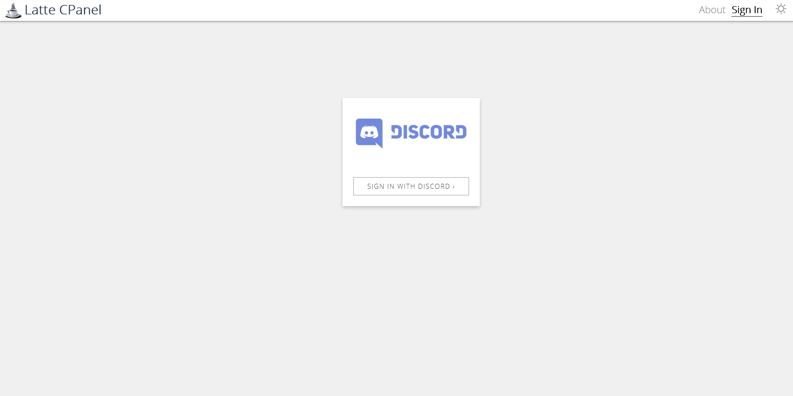
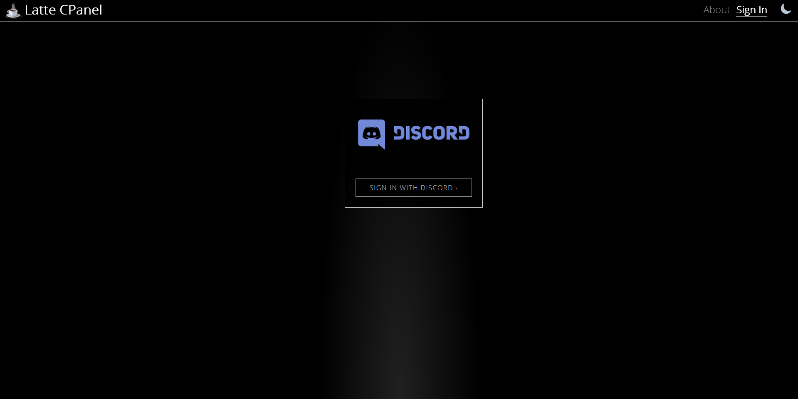
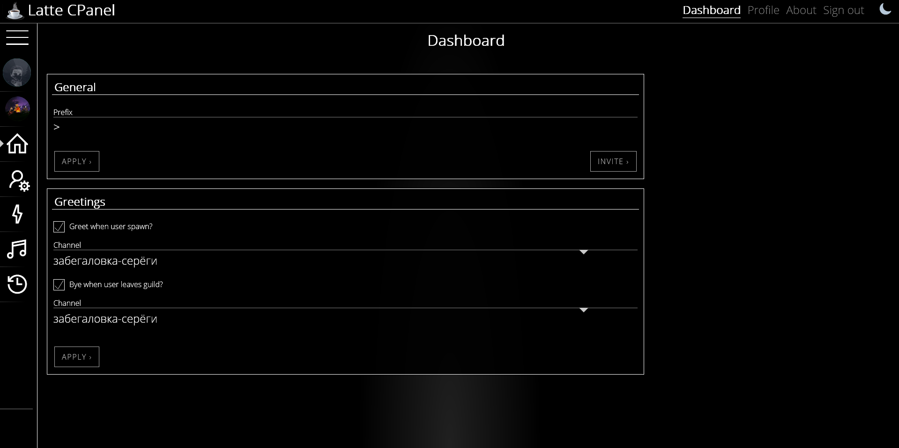
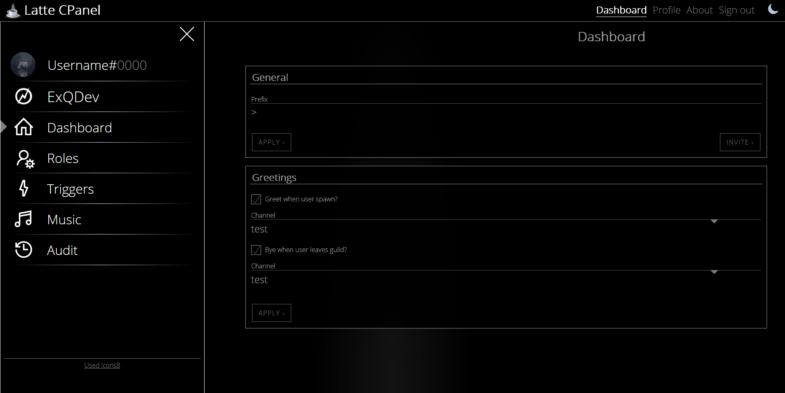
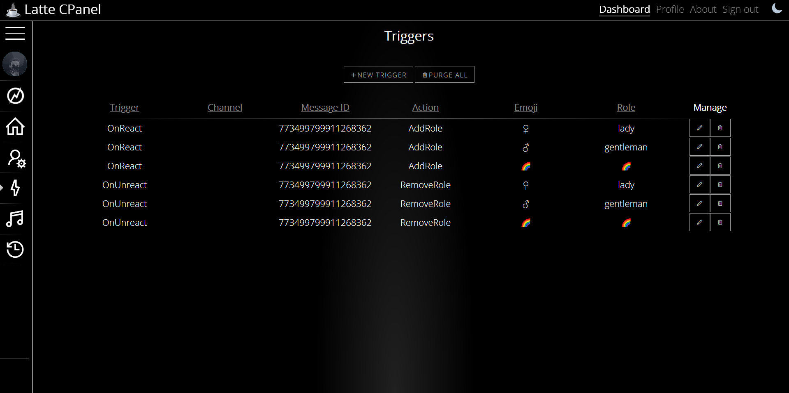
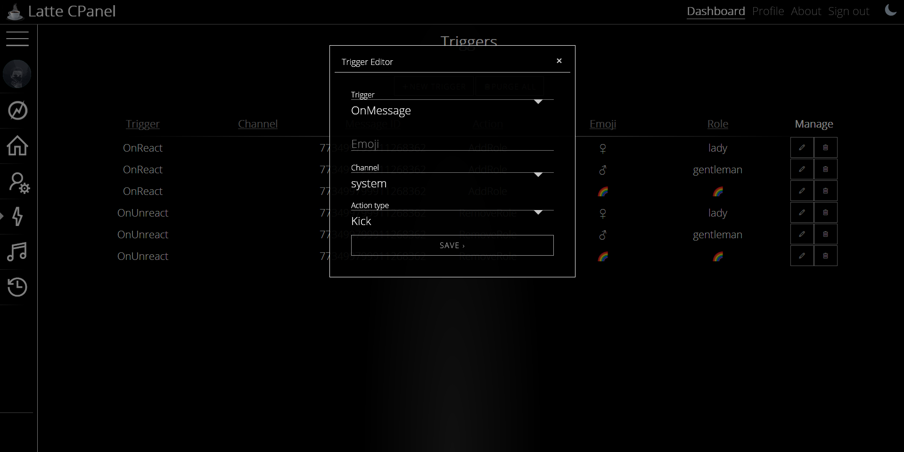
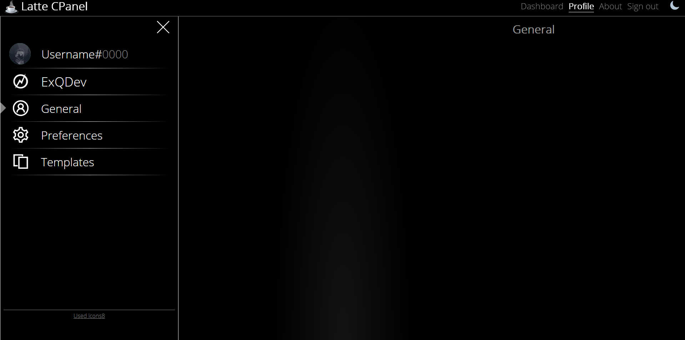

# Latte CPanel

> Latte Control Panel for Latte Discord bot

## Build Setup

``` bash
# install dependencies
yarn 

# serve with hot reload at localhost:8080
yarn dev

# build for production with minification
yarn build

# check lint
yarn lint

# run unit tests
yarn unit

# run e2e tests
yarn e2e

# run all tests
yarn test
```

For a detailed explanation on how things work, check out the [guide](http://vuejs-templates.github.io/webpack/) and [docs for vue-loader](http://vuejs.github.io/vue-loader).


## Usage

There are 3 components of Latte system:
+ Running bot (official or your own instace)
+ Running server for Conteol Panel
+ Running Control Panel

Development running:

```
yarn dev
```

By default located at `http://localhost:8080`.

Open `Sign In` page and log in to system with Discord. 




After authentication, there will be opened `Dashboard` with main preferences of bot for each server. (A list of available servers is under your nickname on `Drawer`. You can select current server by clicking on it to drop the dropdown).




Now available triggers for servers, e.g. when user reacts to the message, do something, like add or remove role, kick, ban on message etc.





`Drawer` is dynamic, and changes menu items for `Profile` and `About`:



This is development version, so it will be supplemented.
Design is own, icons used from [Icons8](https://icons8.com/).
